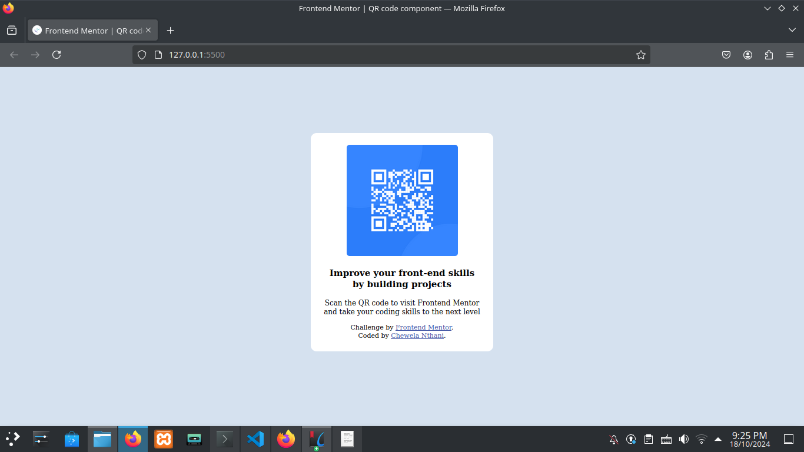

# Frontend Mentor - QR code component solution

This is a solution to the [QR code component challenge on Frontend Mentor](https://www.frontendmentor.io/challenges/qr-code-component-iux_sIO_H). Frontend Mentor challenges help you improve your coding skills by building realistic projects. 

## Table of contents

- [Overview](#overview)
  - [Screenshot](#screenshot)
  - [Links](#links)
- [My process](#my-process)
  - [Built with](#built-with)
  - [What I learned](#what-i-learned)
  - [Continued development](#continued-development)
  - [Useful resources](#useful-resources)
- [Author](#author)
- [Acknowledgments](#acknowledgments)


## Overview

### Screenshot



### Links

- Solution URL: [Add solution URL here](https://github.com/TheeCodeSmith/qr-code-component-main)
- Live Site URL: [Add live site URL here](https://github.com/TheeCodeSmith/qr-code-component-main)

## My process
I decided to go with using CSS Flexbox because I am more comfortable with that at the moment. This involved creating a lot of new DIVs in the html to act as containers. Because I find it hard to work with hsv colors, I went to gimp and looked up the hexadecimal equivalent. I am wiling to change them to hsv if I am required to do so.

### Built with

- Semantic HTML5 markup
- CSS custom properties
- Flexbox
- gimp (Color picker)

### What I learned
I have learnt how to consolidate all my fuzzy knowledge of html, css and git into one workable knowledge block. Not much NEW information, but still very valuable in taking my next steps. Below is some of the code I am definitly proud of.


```html

```
```css
  body{
    background-color:#d5e1ef;
    font-family: "Outfit";
    display:flex;
    justify-content: center;
    align-items: center;
    font-size:15px;
    height:100vh;
}
```

### Continued development
I would really love to focus more on the mobile first approach. I found myself doing the desktop layout first even when I know that mobile first is the best.

### Useful resources

- [Resource 1](https://www.google.com/search?client=ubuntu-sn&channel=fs&q=media+query+in+css) - This short google search helped me out to remember the syntax for media queries. It may loo simple, but I recommend this for anyone who forgets.

## Author

- Website - [Chewela Nthani](https://github.com/TheeCodeSmith/qr-code-component-main)
- Frontend Mentor - [@TheeCodeSmith](https://www.frontendmentor.io/profile/TheeCodeSmith)


## Acknowledgments

This may seem cheesy, but I would just LOVE to thank the frontendmentor team for providing this challenge. It may not seem like much, but it has really opened my eyes tothe importance of practise and doing realistic projects.
